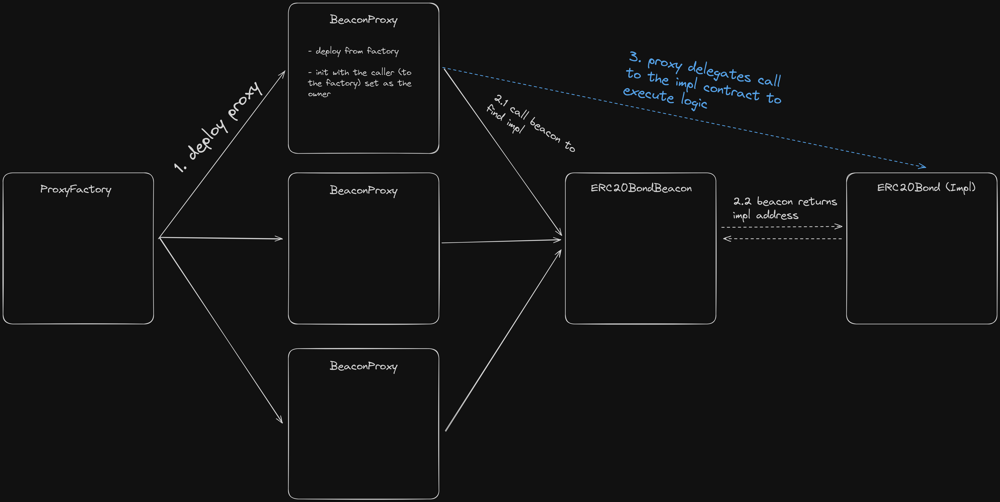
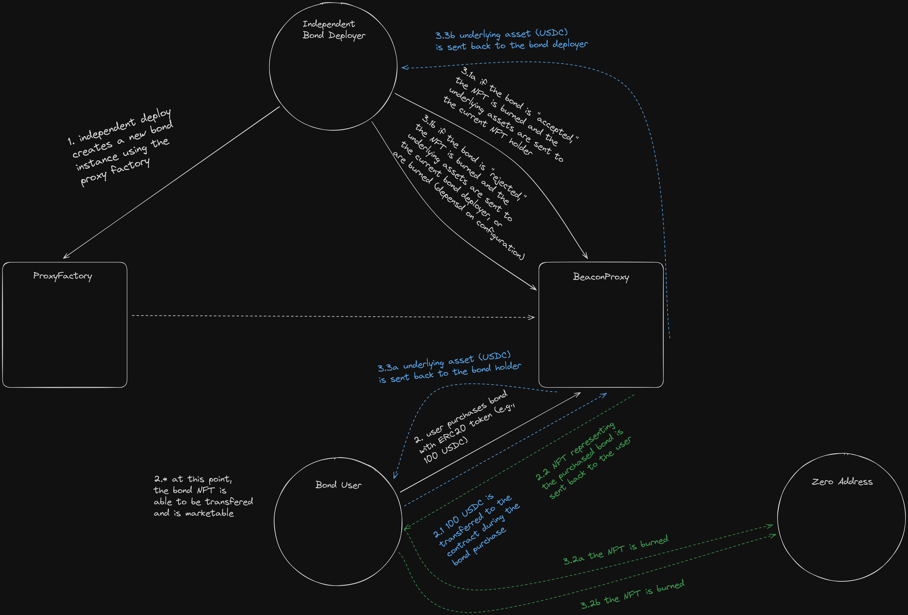

# On Chain Bonds

[](https://soliditylang.org/)
[](https://book.getfoundry.sh/)
[](https://conventionalcommits.org)

A (kind-of) decentralized and (relatively) gas-efficient protocol for deploying and managing general purpose on-chain bonds, represented as ERC721 (NFT) tokens. 

This is a sister project of [vile/eth-bonds](https://github.com/vile/eth-bonds), inspired by the same issue.

<center>

</center>

## Protocol Architecture

Simply put, the protocol is a *mostly* decentralized, completely un-owned, non-upgradeable beacon proxy pattern.
However, individual instances of Bonds **are owned**, but potentially can be decentralized.

The initial protocol deployment consists are three (3) parts:

1) BondERC20 Implementation
2) Non-Upgradeable Beacon
3) Beacon Proxy Factory

<details>
<summary>General Architecture Diagram</summary>
<br/>



</details>

Entities who are interested in using the protocol, can deploy a beacon proxy (using the proxy factory), which creates a new "instance" of an independently owned Bond.
The initial owner is the proxy contract caller, but ownership can be transferred to, say, a multi-sig operated by a decentralized governance structure.

<details>
<summary>Bond Life Cycle</summary>
<br/>



</details>


Beyond this extra step and external infrastructure, the owner of the Bond instance has the final say in "accepting" or "rejecting" bonds.
And, therefore, without a decentralized instance owner, all users who mint bonds **must** trust the owner to act in good faith.
Ownership is required for each Bond instance to function; there is no other way to properly handle accepting or rejecting bonds, as each instance can have arbitrary, socialized rulesets that may/must be evaluated  by human judgment.

## Getting Started

### Requirements

1. Git - [Install Git](https://git-scm.com/book/en/v2/Getting-Started-Installing-Git)
   1. Check if you have Git installed with `git --version`
2. Foundry - [Install Foundry](https://getfoundry.sh/)
   1. Check if you have Foundry installed with `forge --version`
### Installation

```bash
git clone https://github.com/vile/on-chain-bonds.git
cd on-chain-bonds
make # clean, install deps, build
```

## Usage

See the [Static Analyzers](#static-analyzers) for external tool installation.


### Testing

Run all Foundry tests, slither, and aderyn:

```bash
make test-ext
```

Run slitherin instead of slither:

```bash
make test-ext2
```

Run individual tests:

```bash
forge test --mt test_testName -vvvvv
```

### Deploying

#### Test Net Funding

Deployments on testnets can get a little pricey (ETH-wise), and sometimes faucets don't cut it.
If that is the case, [LayerZero's TestNet Bridge](https://testnetbridge.com/) allows you to bridge a small amount (usually less than $2) from a handful of L2s to Ethereum L1 Sepolia.
On average, bridging 0.0001 ETH from ARB or OP to ETH L1 Sepolia, gives ~3.5 sepETH.
When deploying on L2 testnets, use their respective bridges, such as the [Arbitrum Sepolia bridge](https://bridge.arbitrum.io/?destinationChain=arbitrum-sepolia&sourceChain=sepolia) or the [Optimism Sepolia bridge via SuperBridge](https://superbridge.app/op-sepolia).

#### Deployer Wallet, RPCs, API Key(s)

This project uses [Foundry's keystore](https://book.getfoundry.sh/reference/cast/cast-wallet) feature to manage deployer wallet(s).
As such, either import your existing deployer private key using `cast wallet import`.
Or, generate a new keystore (and associated private key) using:

```bash
cast wallet new ~/.foundry/keystores # this is the default foundry keystore folder on linux 
# Enter secret: [your keystore password here]
cast wallet list # check your new keystore (usually will be a random alphanumeric string)
mv ~/.foundry/keystores/name-of-keystore-you-generated ~/.foundry/keystores/new_key_name # rename your local keystore file
cast wallet list # ensure it was renamed
```

You need to prepare your `.env` file before you can add your RPC and Etherscan API key.
To do so, simply rename the current `.env.example` using `mv .env.example .env`.
**NEVER SHARE THIS FILE OR ITS CONTENTS, INCLUDING UPLOADING IT TO A GIT REPO**.

An easy RPC solution is [Alchemy](https://www.alchemy.com/).
Either create an account with Alchemy, or sign-in using your GitHub account.
Then, create a new app on the Alchemy dashboard, and copy your target deployment chain's HTTP RPC URL (for this example, Sepolia).
Now, put the copied RPC URL after the `=` in `.env` under `ETHEREUM_SEPOLIA_RPC_URL`.
Follow the same process to deploy on other networks, such as Arbitrum (e.g., under `ARBITRUM_SEPOLIA_RPC_URL`).

Now, to get an Etherscan API key (used to verify the contracts on the block explorer), [create an Etherscan account](https://etherscan.io/register), or if you already have one, use that.
Then, [create a new API key](https://etherscan.io/myapikey) in your account settings.
Copy that API key, and put it after the `=` in `.env` under `ETHERSCAN_API_KEY`.
Etherscan API keys work across **all Ethereum network** explorers (Mainnet, Sepolia, Holesky, etc.).
Follow the same process to verify on other deployed networks, such as Arbitrum (e.g., under `ARBISCAN_API_KEY`).

#### CREATE2 Salts

All contracts are deployed using the [Keyless CREATE2 Factory](https://etherscan.io/address/0x0000000000ffe8b47b3e2130213b802212439497).
This means that unique salts were mined for this specific protocol's deployer address ([0x2F51](https://sepolia.etherscan.io/address/0x2F5106Cc200E804c2233D204FF817d4313604469)).
As such, deploying from a different wallet requires different salts to be used for efficient 0-leading addresses, if desired.

Salts must be mined sequentially, as previous addresses are required for the beacon and proxy factory constructors.
A helper forge script (`./script/util/CodeCreationScript.s.sol`), helps manage the `INIT_CODE_HASH` of each contract as two of them take constructor arguments.

#### Running Deploy Script

To run a test (anvil) deployment, use:

```bash
# start Anvil (in a separate terminal)
anvil

# run the (old, non-CREATE2) deploy script, targeting the local Anvil chain
make deploy-anvil
```

To run a forked test deployment (against Ethereum Sepolia), use:

```bash
make fork-create2-deploy KEYSTORE=DEPLOYER_KEYSTORE # change `DEPLOYER_KEYSTORE` to your actual keystore name
```


To run a live, testnet deployment, use:

**Ethereum Sepolia:**
```bash
make deploy-eth-sepolia-create2 KEYSTORE=DEPLOYER_KEYSTORE # change `DEPLOYER_KEYSTORE` to your actual keystore name
```

**Arbitrum Sepolia:**
```bash
make deploy-arb-sepolia-create2 KEYSTORE=DEPLOYER_KEYSTORE # change `DEPLOYER_KEYSTORE` to your actual keystore name
```

**Optimism Sepolia**
```bash
make deploy-op-sepolia-create2 KEYSTORE=DEPLOYER_KEYSTORE # change `DEPLOYER_KEYSTORE` to your actual keystore name
```

Running the live deployment command will deploy all the required contracts, and verify them on their respective Etherscan block explorers.

#### Retrying Failed Etherscan Verifications

For some reason if verifications fail during script execution, and `forge verify-contract` is not working, change your network deploy target in `Makefile` to a fork deploy instead.
This will have foundry re-try the verification (which is somehow different than `verify-contract`) after the script has finished, like normal.

For example, if you're attempting to re-verify OP Sepolia, your target will look like the following (notice that `rpc-url` is now `fork-url` and the removal of `--broadcast`):

```bash
deploy-op-sepolia-create2 :; forge script script/DeployWithCREATE2FactoryScript.s.sol:DeployWithCREATE2FactoryScript --account $(KEYSTORE) --fork-url $(OPTIMISM_SEPOLIA_RPC_URL) --verify --etherscan-api-key $(OP_ETHERSCAN_API_KEY) -vvvv
```

### Live Deployments

All live deployment across all networks share the same address, and are deployed using the [Keyless CREATE2 Factory](https://etherscan.io/address/0x0000000000FFe8B47B3e2130213B802212439497).

#### Ethereum Sepolia

| Contract                      | Address                                                                                                                       |
| ----------------------------- | ----------------------------------------------------------------------------------------------------------------------------- |
| BondERC20 (Implementation)    | [0x0000000a9900006ee5AEe818870B573e3F00EFdE](https://sepolia.etherscan.io/address/0x0000000a9900006ee5AEe818870B573e3F00EFdE) |
| NonUpgradeableBondERC20Beacon | [0x00000000002A68e045fcF1b392cD1C53D4A400aA](https://sepolia.etherscan.io/address/0x00000000002A68e045fcF1b392cD1C53D4A400aA) |
| BondERC20ProxyFactory         | [0x00000000000d2F16966bD08eb4424a60E8C9008e](https://sepolia.etherscan.io/address/0x00000000000d2F16966bD08eb4424a60E8C9008e) |

#### Arbitrum Sepolia

| Contract                      | Address                                                                                                                      |
| ----------------------------- | ---------------------------------------------------------------------------------------------------------------------------- |
| BondERC20 (Implementation)    | [0x0000000a9900006ee5AEe818870B573e3F00EFdE](https://sepolia.arbiscan.io/address/0x0000000a9900006ee5AEe818870B573e3F00EFdE) |
| NonUpgradeableBondERC20Beacon | [0x00000000002A68e045fcF1b392cD1C53D4A400aA](https://sepolia.arbiscan.io/address/0x00000000002A68e045fcF1b392cD1C53D4A400aA) |
| BondERC20ProxyFactory         | [0x00000000000d2F16966bD08eb4424a60E8C9008e](https://sepolia.arbiscan.io/address/0x00000000000d2F16966bD08eb4424a60E8C9008e) |

#### Optimism Sepolia

| Contract                      | Address                                                                                                                                |
| ----------------------------- | -------------------------------------------------------------------------------------------------------------------------------------- |
| BondERC20 (Implementation)    | [0x0000000a9900006ee5AEe818870B573e3F00EFdE](https://sepolia-optimism.etherscan.io/address/0x0000000a9900006ee5AEe818870B573e3F00EFdE) |
| NonUpgradeableBondERC20Beacon | [0x00000000002A68e045fcF1b392cD1C53D4A400aA](https://sepolia-optimism.etherscan.io/address/0x00000000002A68e045fcF1b392cD1C53D4A400aA) |
| BondERC20ProxyFactory         | [0x00000000000d2F16966bD08eb4424a60E8C9008e](https://sepolia-optimism.etherscan.io/address/0x00000000000d2F16966bD08eb4424a60E8C9008e) |

<details>
<summary>Ethereum Sepolia Deprecated Non-CREATE2</summary>

| Contract                      | Address                                                                                                                       |
| ----------------------------- | ----------------------------------------------------------------------------------------------------------------------------- |
| BondERC20 (Implementation)    | [0x596235e3ac7fc8ec0108093722648c5ce7feca85](https://sepolia.etherscan.io/address/0x596235e3ac7fc8ec0108093722648c5ce7feca85) |
| NonUpgradeableBondERC20Beacon | [0xc6d794daa00fe35487fef38b28439dce7c431346](https://sepolia.etherscan.io/address/0xc6d794daa00fe35487fef38b28439dce7c431346) |
| BondERC20ProxyFactory         | [0x24e580ca133cce4040f682298de13d1d7fcbddcd](https://sepolia.etherscan.io/address/0x24e580ca133cce4040f682298de13d1d7fcbddcd) |
| Example Bond Instance (Proxy) | [0x335e088f203cb1eB08c364218869F3e8172615Ea](https://sepolia.etherscan.io/address/0x335e088f203cb1eB08c364218869F3e8172615Ea) |

</details>

### Static Analyzers

<details>
<summary><a href="https://github.com/crytic/slither?tab=readme-ov-file#how-to-install">Slither</a></summary>

```bash
python3 -m pip install slither-analyzer # OR
pipx install slither-analyzer
```

</details>

<details>
<summary><a href="https://github.com/pessimistic-io/slitherin?tab=readme-ov-file#installation-process">Slitherin</a></summary>

```bash
pip install slitherin
# OR
pipx install slitherin
echo -e "# Slitherin with pipx\nexport PATH=\"\$PATH:/home/$USER/.local/pipx/venvs/slitherin/bin\"\n" >> ~/.bashrc \
&& source ~/.bashrc
```

</details>

<details>
<summary><a href="https://github.com/Cyfrin/aderyn?tab=readme-ov-file#using-cargo">Aderyn</a></summary>

```bash
# Install rust if not installed already
curl --proto '=https' --tlsv1.2 -sSf https://sh.rustup.rs | sh
cargo install aderyn
```

</details>

<details>
<summary><a href="https://github.com/Picodes/4naly3er">4n4lyz3r</a></summary>

Refer to repo usage steps.

</details>

## Known Issues

1. Bond instances are to not be used with [any weird ERC20s](https://github.com/d-xo/weird-erc20) (e.g., stETH (rebasing) or PAXG (fee-on-transfer)).
2. Ether can become locked forever in certain contracts if `value` is included with specific function calls.
3. Individual Bond instances (beacon proxies) are owned, users of each bond instance need to trust the owner.
4. NFTs are transferrable; the original bond purchaser (minter) and the recipient of an accepted bond's tokens may differ.
5. When creating proxies, NFT metadata (name, symbol, URI) is not validated or checked that it follows any convention.